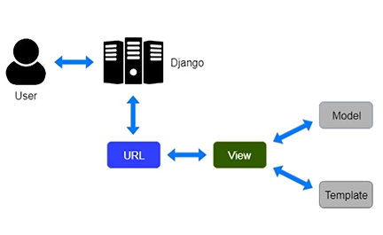

# Django

- It is free and open source web application framework written in Python
- Django offers a big collection of modules which you can use in your own projects

## MVT Architecture of DJANGO

- The MVT ***(Model view Template)*** is a software design pattern
- The view is used to execute the business logic and interact with a model to carry data and renders a template
- There is no separate controller and complete application is based on ModelView and Template

    

